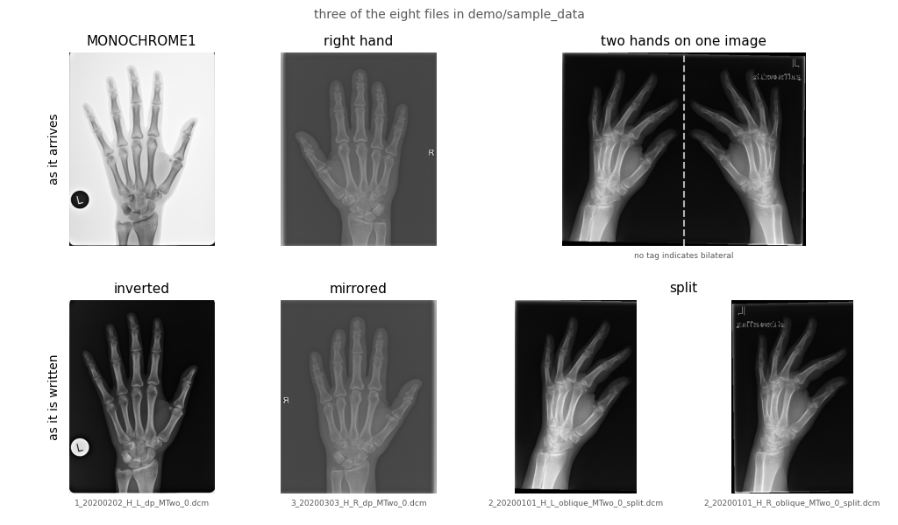

## Content
- [Overview](#overview)
- [Requirements](#requirements)
- [Installation](#installation)
- [Input](#input)
- [Output](#output)
- [Processing flow](#processing-flow)
- [Out of Scope](#out-of-scope)
- [Adapting it to your data](#adapting-it-to-your-data)
- [Package Layout](#package-layout)

---

## Overview


**Unsorted DICOM files in a sorted, named data set of hand radiographs**

A radiology export arrives as the archive stored it -  thousands of files with running
numbers, hands mixed with feet and knees, left and right. This package sorts them, standardizes the images and records what belongs together.


```
what goes in                          what comes out (with current config)
──────────────────────────────────    ────────────────────────────────────────────────
IM_0043.dcm  "Hand dp L"              dicoms/dp/       1_20200101_H_L_dp_MTwo_0.dcm
IM_0044.dcm  "Hand lat R"             dicoms/oblique/  1_20200101_H_R_oblique_MTwo_0.dcm
IM_0045.dcm  "HAND ZITHER VGL"        dicoms/oblique/  two files, one per side (_split)
IM_0046.dcm  "Handgelenk rechts ap"   dropped -- shows no hand
IM_0047.dcm  "Fuss schräg R"          dropped -- not the aimed body part

...                                   csvs/pairs.csv   one row per hand and visit
```

For every single file it decides:

- **what it shows** -- hand, foot or something else; knees, spines and wrists drop out
- **which side** -- left or right; films showing both hands are cut in half
- **which view** -- posterior-anterior (PA) or oblique (OB) (Norgaard/Zither) 
- **how it looks** -- MONOCHROME1 inverted, right hands mirrored to a left hand
- **what belongs together** -- both views of one hand at one visit become one row in
  `pairs.csv`

Body part, side and view are **derived from the header, not read from it.** The tags are
unfortunately not reliable enough, often empty or sometimes even misleading!

Rough manual inspection of about 8,000 processed hand radiographs (but no 100 %
guarantee).

---


## Requirements

Python ≥ 3.9 and `pydicom`, `numpy`, `pandas`, `pyyaml`, `SimpleITK`. `matplotlib` is
optional, only needed for `visualize.py`.

The versions are listed in `pyproject.toml` under `[project] dependencies`. `pip` reads
them.

## Installation

```bash
git clone <this repo>
cd dicom-extremities-preprocessor
pip install -e .              # pip install -e ".[plot]" also installs matplotlib
```

In an environment where the dependencies are already pinned, install without resolving
them:

```bash
pip install --no-deps -e .
```

## Input

```bash
dicom-extremities-preprocessor --input /path/rawdata --output /path/target
```

| Option | Default | Meaning |
|---|---|---|
| `--input` | *required* | raw data folder, searched recursively |
| `--output` | *required* | target folder (optional with `--scan-only`) |
| `--scan-only` | off | headers and categories only, no image written |
| `--bodypart` |`H` | `H` hand, `F` foot, `O` other (one per run) |
| `--views` | `dp,oblique` | which views to keep: `dp`, `oblique`, `lat` |
| `--keep-unpaired` | off | also keep cases where one view is missing |
| `--overwrite` | off | rewrite instead of skipping existing results |
| `--rules` | bundled | an adapted copy of `rules.yaml` |

`--bodypart` takes a single value, `--views` a list. One run therefore covers one body
part in several views -- for hands *and* feet, run it twice into two output folders.

`O` is for rejection inspection: knee, spine, pelvis, and the hand images that show no scoreable
joints (wrist, forearm, single fingers). 

E.g. run from Python, e.g. in a notebook:

```python
import dicom_extremities_preprocessor as pp

pp.run("/path/rawdata", "/path/target", bodypart="H", views=("dp", "oblique"))
```

### Looking without processing

`scan` stops after the header analysis: it reads the configured tags, derives the
categories and returns the table. No pixel is touched, nothing is written -- useful on a
read-only archive, and to see how the rules fall out before committing to a run.

```python
df = pp.scan("/path/rawdata")
df.groupby(["bodypart_new", "view_position_new"]).size()

pp.get_unique_metadata(df, ["filename_old", "filepathname_old"])   # what the free text holds
```

The same from the command line, which prints a summary and writes the table only if an
output folder is given:

```bash
dicom-extremities-preprocessor --input /path/rawdata --scan-only
```

## Output

```
<output>/
├── dicoms/dp/          1_20200101_H_L_dp_MTwo_0.dcm (eg.)
├── dicoms/oblique/     1_20200101_H_L_oblique_MTwo_0_split.dcm (eg.)
├── csvs/               one table per step, plus pairs.csv
├── provenance.json     settings and counts of this run
└── pipeline_<time>.log log of the run
```

**File name:** `{pat_id}_{study_date}_{bodypart}_{side}_{view}_{photometry}_{n}.dcm`, with
`_split` appended if it was cut out of a two-hand image. 


**Duplicates** count with `{n}`: Same patient, same date, same side, same view give the same name. Written files always have a real side (`L`/`R`) and are always `MTwo` (MONOCHROME2).

**Logging** with `provenance.json`: what produced this folder: date, package version, Python version, source folder, etc. (see demo notebook). 

**CSV Files** in `csvs/` holds one table per step. Every decision can be read up: 

- Raw headers (`step1_metadata_df.csv`), 
- Values that actually occur per column
(`step1_unique_values.csv`), 
- Derived categories (`step2_categories.csv`), 
- Passed the filter (`step3_selected_<view>.csv`),
- What was written (`step4_written_<view>.csv`).

**`pairs.csv` is what you use afterwards.** One row per *case* -- one hand at one visit. E.g.:

```
pat_id,study_date,laterality_new,file_dp,file_oblique,status
1,20200101,L,1_20200101_H_L_dp_MTwo_0.dcm,1_20200101_H_L_oblique_MTwo_0.dcm,complete
1,20200101,R,1_20200101_H_R_dp_MTwo_0.dcm,1_20200101_H_R_oblique_MTwo_0.dcm,complete
```

*Patient 1 was there on 2010-03-23, both hands, both views: four images, two rows. One
column `file_<view>` per view, empty where the view is missing, and `status`*

## Processing flow

| Step | What happens | Where | Reads pixels? |
|---|---|---|---|
| 1 | read the header of every file | `header.scan_metadata` | no |
| 2 | derive body part, side, view, photometry, build the file name | `rules.categorize` | no |
| 3 | filter to the requested body part and view, number repeats | `rules.select` | no |
| 3b | pick the candidates for a two-hand image: landscape and side `L`/`R` | `pixels.detect_bilateral` | no |
| 3c | check those candidates on the image, set them to side `B` | `pixels.shows_two_hands` | yes but only for candidates |
| 4 | invert MONOCHROME1, mirror right, split `B` in the middle, write | `pixels.write_processed` | yes |
| 5 | pair the views into cases | `pipeline.build_pairs` | no |

**Decisions after manual review of processed images:**
(Some of that is not obvious!!)

- **Free text beats the tag.** `SeriesDescription` decides the body part, and for hands
  also the view! Seems like the tags are often a station default or something.
- **For hands, `lat` means oblique.** What the text calls "lat"/"seitl." is the
  Norgaard/Zither position - checked visually on 800 sample images. But not for feet, and
  not for wrists, where "seitl." really is a lateral view. That is one reason wrist images
  have to be filtered out first.
- **Two hands on one image is not always in the tag!** Some are marked in the free text
  ("vgl", "bds"), the rest is decided on the pixel data, by looking for two blocks of
  tissue separated by a gap. Then the image is cut in half and the right half mirrored.
  See demo notebook for more information.
- **Images without a recognisable side are dropped.** Without a side there is no partner
  to pair with and no label to score against.
- **Wrist, forearm and single-finger images are dropped.** They carry
  `BodyPartExamined = HAND` but do not show the joints that get scored.
- **The run is idempotent.** Existing output files are skipped without reading their
  pixels. An aborted run can simply be restarted; for a new run choose an empty directory.

## Out of Scope

No rotation, no registration, no resizing. No quality assessment: blurred or cropped
images run through. No parallelisation; ~17,000 files take about 1.5 hours (mainly I/O)

**No anonymisation.** Patient tags stay in the header and `pat_id` is part of every file
name - Make sure `PatientName` is a pseudo-ID.

**Feet are not really supported.** 
`--bodypart F` runs and the rules are there but everything was only verified on hand images. For feets the rules would have to be adapted and checked on feet. 

## Adapting it to your data

All patterns, thresholds and tag numbers are in
`dicom_extremities_preprocessor/config/rules.yaml`. The patterns are regular expressions
matched against normalised text (lower case, umlauts spelled out), and within a block the
**first** match wins (hierarchical keyword matching), so the order matters - `oblique` has to stand before `lat`.

The rules grew on a German speaking cohort. Two rules are cohort-specific and should be checked on images, not on text:
`hand.lat_is_oblique` and the thresholds under `bilateral`.

## Package Layout

```
dicom_extremities_preprocessor/   the package
├── pipeline.py                   the order of the steps: run(), scan()
├── rules.py                      what gets decided
├── header.py                     reading headers, no pixels
├── pixels.py                     everything that touches pixel data
├── utils.py                      logging, and a helper for new rules
├── cli.py                        command line
├── visualize.py                  optional - image grids
└── config/rules.yaml             the only configuration file

demo/     explanation only, not needed to run the package
tests/    24 pytest tests -- run `pytest` after changing rules.yaml
```
`test_rules.py` checks the decisions on constructed header rows and needs no data -- these
14 tests are the ones that matter after a change to `rules.yaml`. `test_pipeline.py` runs
the whole chain over `demo/sample_data`; since no DICOMs ship with the repository (see
[`demo/README.md`](demo/README.md)) those 10 tests skip until you put your own files there.
